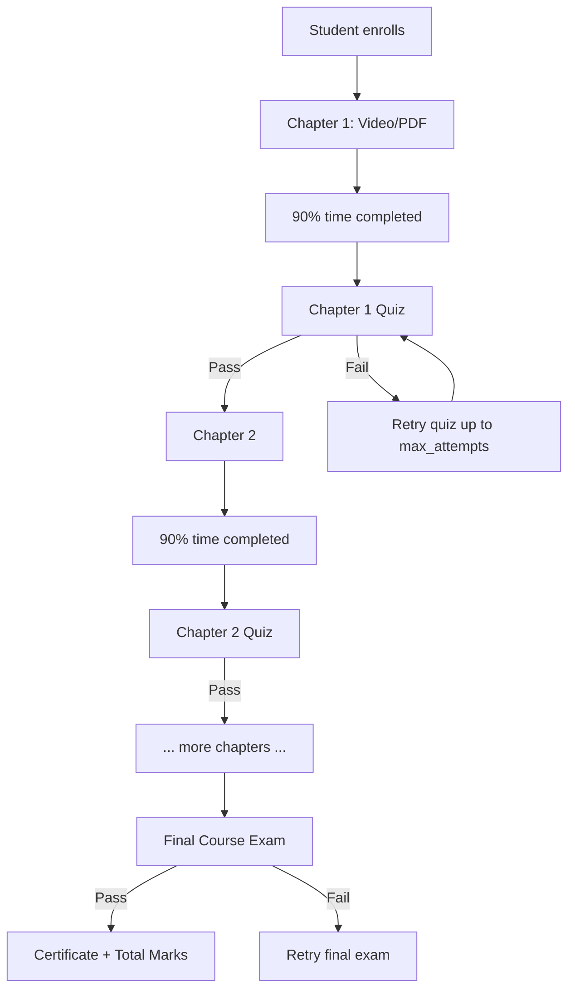
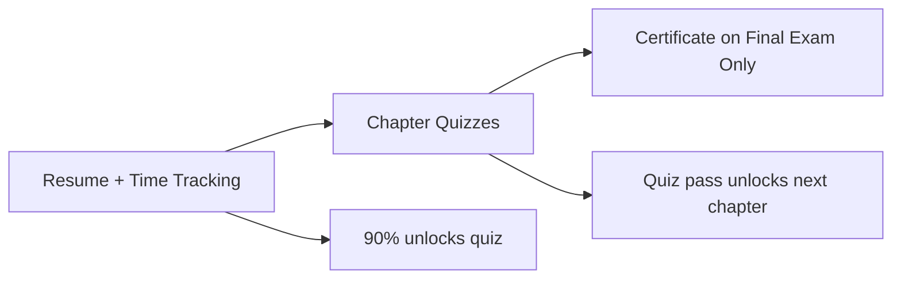

# Chapter Quizzes + Final Exam + Marks — Implementation Plan

## Should You Do This?

**Short answer:** It is **valuable but optional**. Sankalp already supports a simpler flow (all chapters → one final test → certificate). Chapter quizzes add real pedagogical value — they verify understanding before moving on — but they are a **product enhancement**, not a bug fix.

| Consider adding quizzes if… | You can skip for now if… |
|-----------------------------|---------------------------|
| You want students to prove chapter-level understanding | Basic completion + one final exam is enough |
| Instructors need formative assessment between chapters | You are still fixing resume/time tracking first |
| You want a marks breakdown (quiz + final) | You do not need per-chapter grades yet |

**Recommendation:** Implement **after** the [resume + time tracking plan](resume_and_time_tracking.md). Time-based chapter completion defines when a quiz unlocks; quizzes define when the *next* chapter unlocks.

---

## Difficulty Assessment

| Area | Difficulty | Effort | Notes |
|------|------------|--------|-------|
| Reuse existing test engine | Low | ~0 day | Questions, attempts, scoring already work |
| Test type + unlock rules | Medium | ~1–2 days | Backend logic changes in `testTakingController` |
| Gate next chapter on quiz pass | Medium | ~1 day | Progression + `completeChapter` changes |
| Admin link quiz to chapter | Low–Medium | ~0.5–1 day | UI missing today; DB field exists |
| Student quiz-between-chapters UX | Medium | ~1–2 days | Flow changes in chapter view + sidebar |
| Marks / grade aggregation | Medium | ~1–2 days | New summary API + profile/admin views |
| **Total** | **Medium–High** | **~5–8 days** | ~40% exists; 60% is wiring + rules |

**Compared to resume/time tracking (~2–3 days):** This is a larger feature because it changes the **learning path rules**, not just tracking.

---

## What Already Exists vs What's Missing

### Already built (reuse as-is)

| Piece | Location | Status |
|-------|----------|--------|
| Test CRUD (questions, options, passing score, time limit, max attempts) | [`TestManagement.jsx`](../frontend/src/components/admin/TestManagement.jsx), [`testController.js`](../backend/controllers/testController.js) | Working |
| Test taking (start, answer, submit, score %) | [`TestTakingModal.jsx`](../frontend/src/components/course/TestTakingModal.jsx), [`testTakingController.js`](../backend/controllers/testTakingController.js) | Working |
| Marks per attempt (`score`, `earned_points`, `total_points`) | [`TestAttempt`](../backend/models/TestAttempt.js) | Working |
| Link test to chapter (DB) | [`CourseChapter.test_id`](../backend/models/CourseChapter.js) | **Schema only** |
| Chapter test UI shell | [`StudentChapterView.jsx`](../frontend/src/components/course/StudentChapterView.jsx) | UI exists, flow broken |
| Final course test section | [`TestSection.jsx`](../frontend/src/components/course/TestSection.jsx) | Working (end-of-course only) |
| Certificate on test pass | [`testTakingController.submitTest`](../backend/controllers/testTakingController.js) | Working but **fires for any test** |

### Missing / broken today

| Gap | Impact |
|-----|--------|
| No `test_type` on `CourseTest` | Cannot distinguish chapter quiz vs final exam |
| `startTest` blocks **all** tests until 100% chapters done | Chapter quizzes cannot be taken mid-course |
| Passing **any** test auto-issues certificate | Chapter quiz pass would wrongly certify student |
| Next chapter only checks `ChapterProgress.is_completed` | Quiz pass is not required to proceed |
| Admin cannot assign `test_id` to a chapter | [`ChapterManagement.jsx`](../frontend/src/components/admin/ChapterManagement.jsx) has no quiz field |
| No course-level marks summary | Scores exist per attempt but not aggregated for display |
| `ChapterProgress` has no `quiz_passed` / `quiz_score` | Resume/progression cannot show quiz state |

---

## Target Learning Flow



**Rules:**
1. Chapter content must reach 90% time (from resume/time plan) before quiz unlocks.
2. Chapter quiz must be **passed** (score ≥ passing_score) before next chapter unlocks.
3. Final exam unlocks only after **all chapters + all chapter quizzes** are passed.
4. Certificate and course completion are awarded only on **final exam pass**.
5. Marks = sum/average of chapter quiz scores + final exam score (configurable weighting).

---

## Proposed Data Model Changes

### 1. Add `test_type` to `course_tests`

```sql
test_type ENUM('chapter_quiz', 'final_exam') NOT NULL DEFAULT 'final_exam'
chapter_id INTEGER NULL  -- optional FK for chapter_quiz (redundant with chapter.test_id but useful for queries)
```

- Existing tests → migrate as `final_exam`.
- Chapter quiz → `test_type = 'chapter_quiz'` + linked via `course_chapters.test_id`.

### 2. Extend `chapter_progress` (recommended)

Add to [`ChapterProgress`](../backend/models/ChapterProgress.js):

| Column | Type | Purpose |
|--------|------|---------|
| `quiz_passed` | BOOLEAN | Student passed linked chapter quiz |
| `quiz_best_score` | DECIMAL(5,2) | Highest quiz score % |
| `quiz_attempts` | INTEGER | Attempt count |
| `quiz_passed_at` | DATE | When quiz was first passed |

Alternative: derive from `TestAttempt` at query time (no migration) — simpler but slower; fine for v1.

### 3. Optional: `enrollment` grade summary

| Column | Type | Purpose |
|--------|------|---------|
| `total_marks` | DECIMAL(5,2) | Aggregated course score |
| `chapter_quiz_avg` | DECIMAL(5,2) | Average of chapter quiz scores |
| `final_exam_score` | DECIMAL(5,2) | Final exam best score |

Can also compute on read from `TestAttempt` joins — prefer computed v1, cache later if needed.

---

## Backend Changes

### A. `startTest` — different rules by type

**File:** [`backend/controllers/testTakingController.js`](../backend/controllers/testTakingController.js)

| test_type | Unlock condition |
|-----------|------------------|
| `chapter_quiz` | Parent chapter content completed (90% time + `is_completed` or equivalent); previous chapters + their quizzes passed |
| `final_exam` | All chapters complete AND all chapter quizzes passed (if configured) |

Remove the blanket “all chapters must be complete” check for `chapter_quiz`.

### B. `submitTest` — certificate only on final exam

**File:** [`backend/controllers/testTakingController.js`](../backend/controllers/testTakingController.js)

Current behavior (line ~367): any pass → `enrollment.certify()` + certificate.

**New behavior:**
- `chapter_quiz` pass → update `ChapterProgress.quiz_passed`, notify student, **no certificate**
- `final_exam` pass → `enrollment.certify()`, generate certificate, compute `total_marks`

### C. `completeChapter` — optional quiz gate

**File:** [`backend/controllers/enrollmentController.js`](../backend/controllers/enrollmentController.js)

If chapter has `test_id`:
- Marking chapter complete via “Next” should either:
  - **Option chosen:** Content complete opens quiz; quiz pass marks chapter fully done and unlocks next.
  - Do not allow `is_completed = true` until quiz is passed when `test_id` is set.

### D. `getChapterProgression` — include quiz state

**File:** [`backend/controllers/enrollmentController.js`](../backend/controllers/enrollmentController.js)

Add per chapter:
```js
{
  quiz_required: !!chapter.test_id,
  quiz_passed: ...,
  quiz_best_score: ...,
  quiz_unlocked: contentCompleted,  // 90% time gate
  is_accessible: previousChapterComplete && previousQuizPassed
}
```

### E. Marks summary API (new)

`GET /enrollments/:id/grades` or extend `GET /enrollments/:id/progression`:

```js
{
  chapterQuizzes: [{ chapterId, title, bestScore, passed, attempts }],
  finalExam: { testId, bestScore, passed, attempts },
  totalMarks: 82.5,   // e.g. 40% avg quizzes + 60% final
  breakdown: { quizWeight: 40, finalWeight: 60 }
}
```

---

## Frontend Changes

### Admin

| File | Change |
|------|--------|
| [`ChapterManagement.jsx`](../frontend/src/components/admin/ChapterManagement.jsx) | Add “Chapter Quiz” section — create new quiz or pick existing; sets `test_id` + `test_type` |
| [`TestManagement.jsx`](../frontend/src/components/admin/TestManagement.jsx) | Show test type badge; filter by chapter vs final |
| [`EditCourse.jsx`](../frontend/src/components/admin/EditCourse.jsx) | Mark one test as “Final Exam” (only one per course) |

### Student

| File | Change |
|------|--------|
| [`StudentChapterView.jsx`](../frontend/src/components/course/StudentChapterView.jsx) | After content 90%: show “Take Chapter Quiz” CTA; block Next until quiz passed |
| [`ChapterSidebar.jsx`](../frontend/src/components/course/ChapterSidebar.jsx) | Icons: content done ✓, quiz pending 🔒, quiz passed ✓, score badge |
| [`TestTakingModal.jsx`](../frontend/src/components/course/TestTakingModal.jsx) | On chapter quiz pass: refetch progression, unlock next chapter (no cert toast) |
| [`TestSection.jsx`](../frontend/src/components/course/TestSection.jsx) | Unlock when all chapter quizzes passed (not just chapters) |
| [`ProfilePage.jsx`](../frontend/src/pages/ProfilePage.jsx) / [`AdminStudentProfilePage.jsx`](../frontend/src/pages/AdminStudentProfilePage.jsx) | Show marks breakdown |

---

## Marks Calculation (Proposed Default)

| Component | Weight | Source |
|-----------|--------|--------|
| Chapter quizzes | 40% | Average of best score per chapter quiz |
| Final exam | 60% | Best final exam attempt score |

**Example:** 3 chapter quizzes (80%, 90%, 70%) → avg 80% → `(80 × 0.4) + (85 × 0.6) = 83%` total marks.

Make weights configurable per course later (`courses.quiz_weight`, `courses.final_weight`).

---

## Implementation Phases

### Phase 1 — Foundation (~2 days)
1. Migration: `test_type` on `course_tests`
2. Fix `startTest` / `submitTest` type-based rules
3. Stop certificate generation for `chapter_quiz`

### Phase 2 — Gating (~2 days)
4. Extend progression API with quiz fields
5. Gate next chapter on quiz pass
6. Integrate with 90% time gate from resume plan

### Phase 3 — Admin + Student UX (~2 days)
7. Admin: link/create chapter quiz in chapter form
8. Student: quiz prompt after content, sidebar status, updated TestSection unlock

### Phase 4 — Marks (~1–2 days)
9. Grades summary API
10. Display on profile + admin student view
11. Store best scores; show attempt history

### Phase 5 — QA (~1 day)
12. Full flow test with 2 chapters + 2 quizzes + 1 final exam

---

## Relationship to Other Plans



| Plan | Dependency |
|------|------------|
| Resume tracking | Independent — do first |
| 90% time gate | **Required before** quiz unlock makes sense |
| Chapter quizzes | Depends on time gate for clean UX |
| Final exam + marks | Can use existing test engine after quiz types exist |

---

## Risks and Decisions

1. **Quiz optional vs mandatory:** Plan assumes mandatory when `test_id` is set. Chapters without a linked quiz behave as today.
2. **Retakes:** Use existing `max_attempts` on `CourseTest`. Failed students retry until pass or attempts exhausted (then admin review or reset).
3. **Courses with only a final exam:** No change — existing behavior preserved for `final_exam` tests.
4. **Certificate timing:** Must fix before enabling chapter quizzes in production (otherwise quiz pass certifies early).
5. **Content-only chapters mixed with quiz chapters:** Supported — quiz only required where admin linked one.

---

## Testing Checklist

- [ ] Chapter without quiz — student proceeds after 90% time (same as today + time gate)
- [ ] Chapter with quiz — quiz locked until 90% content time
- [ ] Fail chapter quiz — next chapter stays locked
- [ ] Pass chapter quiz — next chapter unlocks; score visible
- [ ] All chapters + quizzes done — final exam unlocks
- [ ] Pass final exam — certificate issued; total marks shown
- [ ] Pass chapter quiz — **no** certificate issued
- [ ] Admin can create and link quiz to chapter
- [ ] Admin student profile shows marks breakdown
- [ ] Resume returns to correct chapter/quiz state after refresh

---

## Bottom Line

| Question | Answer |
|----------|--------|
| **Do we need this?** | Not for a minimal LMS, but **yes** if you want knowledge checks and marks between chapters |
| **How hard?** | **Medium–High (~5–8 days)** — test engine exists; rules, gating, admin linking, and grading are new |
| **Start from scratch?** | **No** — ~40% built (`CourseTest`, `TestAttempt`, `test_id` on chapters, UI shells) |
| **When to build?** | After resume + 90% time tracking |
| **Biggest fix first** | Split `chapter_quiz` vs `final_exam` and stop auto-certificate on chapter quiz pass |
