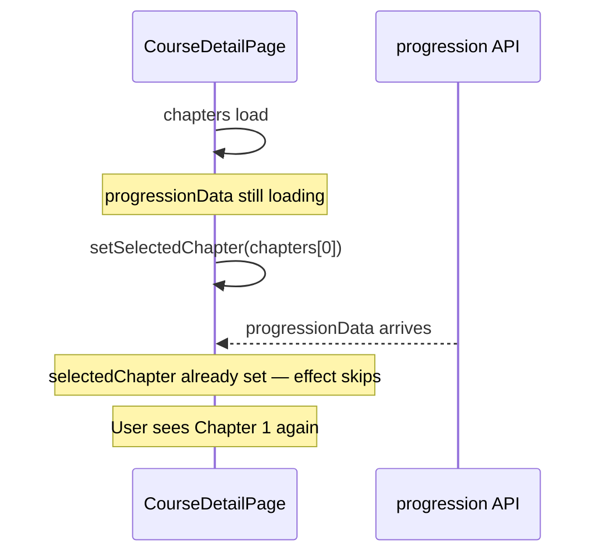
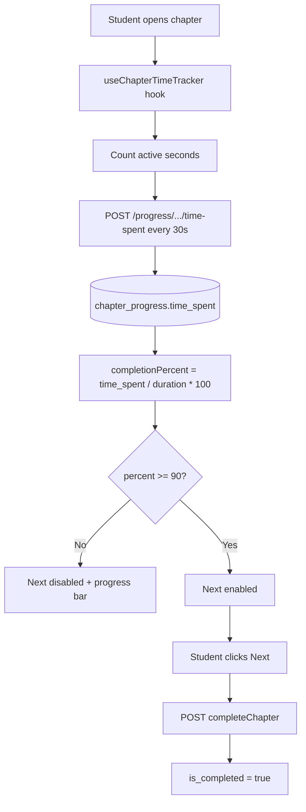

# Course Resume + 90% Time Tracking — Implementation Plan

## Difficulty Assessment

| Feature | Difficulty | Effort | Why |
|---------|------------|--------|-----|
| **Course resume** | Low–Medium | ~0.5–1 day | Mostly frontend; backend already stores `ChapterProgress.is_completed` |
| **90% minutes tracking + gated Next** | Medium | ~1–2 days | Backend APIs exist but are unused; need timer UX, admin duration, server validation |
| **Combined** | **Medium** | **~2–3 days** | No major new subsystem; fix wiring + one custom hook |

**Good news:** Sankalp already has ~70% of the plumbing. You are extending what exists, not building progress tracking from scratch.

---

## Current State (What Exists Today)

### Backend (already built)

- [`ChapterProgress`](backend/models/ChapterProgress.js) stores per-chapter: `is_completed`, `video_watched`, `pdf_viewed`, `time_spent` (minutes)
- [`CourseChapter.duration_minutes`](backend/models/CourseChapter.js) — expected chapter length (admin can set in [`ChapterManagement.jsx`](frontend/src/components/admin/ChapterManagement.jsx))
- Progress APIs in [`backend/routes/chapterProgress.js`](backend/routes/chapterProgress.js):
  - `GET /progress/enrollment/:enrollmentId` — all chapter progress
  - `POST .../time-spent` — add minutes
  - `POST .../video-watched`, `POST .../pdf-viewed`
- Chapter completion: `POST /enrollments/:id/chapters/:chapterId/complete` ([`enrollmentController.completeChapter`](backend/controllers/enrollmentController.js))
- Progression API: `GET /enrollments/:id/progression` returns `is_completed`, `is_accessible`, `time_spent` per chapter

### Frontend (gaps)

- [`CourseDetailPage.jsx`](frontend/src/pages/CourseDetailPage.jsx) tries to resume but has **two bugs**
- [`VideoPlayer.jsx`](frontend/src/components/course/VideoPlayer.jsx) marks video watched on load — **no time tracking**
- [`SmartPDFViewer.jsx`](frontend/src/components/course/SmartPDFViewer.jsx) — **no progress API calls**
- **Next button** in [`StudentChapterView.jsx`](frontend/src/components/course/StudentChapterView.jsx) is always enabled; clicking it immediately calls `completeChapter`
- No frontend service wrapper for `/progress/*` endpoints (only direct call in VideoPlayer)

---

## Root Cause: Why Resume Fails Today



**Bug 1 — Race condition:** The effect only runs when `!selectedChapter`. If chapters load before progression API returns, it falls back to `chapters[0]` and never re-evaluates.

**Bug 2 — Wrong selection logic:** Even when progression loads first, code picks the **first accessible** chapter:

```150:165:frontend/src/pages/CourseDetailPage.jsx
  useEffect(() => {
    if (chapters.length > 0 && !selectedChapter) {
      if (progressionData?.data?.chapters) {
        const firstAccessibleChapter = progressionData.data.chapters.find(ch => ch.is_accessible)
        // ...
      }
      setSelectedChapter(chapters[0])
    }
  }, [chapters, progressionData, selectedChapter])
```

Chapter 1 is always `is_accessible`, so completed students still land on Chapter 1.

**Correct resume rule:**
1. First chapter where `is_accessible && !is_completed` → **resume here**
2. If all complete → last chapter (or test section)
3. If no progression yet → wait (show loading), do not default to chapter 1

---

## Feature 1: Course Resume Tracking

### Backend changes (minimal)

Enhance [`getChapterProgression`](backend/controllers/enrollmentController.js) response with a computed field:

```js
resumeChapterId: /* first incomplete accessible chapter, or last chapter if all done */
```

This keeps resume logic in one place (backend) and avoids duplicating sequential-access rules on the frontend.

### Frontend changes

**File:** [`frontend/src/pages/CourseDetailPage.jsx`](frontend/src/pages/CourseDetailPage.jsx)

- Replace the current `useEffect` with resume logic that:
  - Waits for `progressionData` when user is enrolled student
  - Uses `resumeChapterId` from API (or client-side equivalent)
  - Re-runs when `enrollment.id` or course `id` changes (reset `selectedChapter` on course switch)
- Optional: persist last viewed chapter in `localStorage` as fallback if API is slow (key: `resume:${enrollmentId}`)

**File:** [`frontend/src/components/course/ChapterSidebar.jsx`](frontend/src/components/course/ChapterSidebar.jsx)

- Visually highlight the **current/resume** chapter (e.g. "Continue here" badge)
- Show checkmarks for completed chapters (progression data already available)

**Optional:** Update `last_accessed_at` on enrollment when student opens a chapter (backend middleware or small PATCH) — [`Enrollment`](backend/models/Enrollment.js) already has this field.

---

## Feature 2: Minutes Tracking + 90% Gate Before Next

### Business rules (proposed defaults)

| Rule | Value |
|------|-------|
| Required completion | `time_spent >= 90%` of `chapter.duration_minutes` |
| Default duration if admin left blank | **10 minutes** (config constant) |
| Timer runs when | Chapter content tab is visible (`document.visibilityState === 'visible'`) |
| Timer pauses when | Tab hidden, user navigates away, modal open |
| Sync to server | Every **30 seconds** + on chapter unmount |
| Next button | Disabled until 90% reached; on click → `completeChapter` → navigate |
| Already-completed chapters | Next enabled immediately (revisit mode) |

### Architecture



### New frontend pieces

**1. `frontend/src/services/progressService.js`** (new)

Wrap existing backend endpoints:

- `getChapterProgress(enrollmentId)`
- `addTimeSpent(enrollmentId, chapterId, minutes)`
- `markPdfViewed(...)`

**2. `frontend/src/hooks/useChapterTimeTracker.js`** (new)

Responsibilities:

- Accept `enrollmentId`, `chapterId`, `durationMinutes`, `isCompleted`
- Track elapsed active time with `setInterval` (1s locally, batch to server every 30s)
- Return `{ timeSpent, completionPercent, canProceed, isTracking }`
- Flush remaining time on unmount / chapter change
- Load initial `time_spent` from progression or progress API

**3. Wire into content viewers**

| File | Change |
|------|--------|
| [`StudentChapterView.jsx`](frontend/src/components/course/StudentChapterView.jsx) | Use hook; show progress bar ("8 / 10 min — 80%"); gate Next/Complete buttons on `canProceed` |
| [`ChapterNavigation.jsx`](frontend/src/components/course/ChapterNavigation.jsx) | Same gating for bottom nav Next button (currently always enabled) |
| [`VideoPlayer.jsx`](frontend/src/components/course/VideoPlayer.jsx) | Remove "mark watched on mount"; optional: keep as secondary signal only |
| [`SmartPDFViewer.jsx`](frontend/src/components/course/SmartPDFViewer.jsx) | Accept `enrollmentId` + `chapterId`; call `markPdfViewed` once when PDF loads |

**4. Admin: ensure durations are set**

- [`ChapterManagement.jsx`](frontend/src/components/admin/ChapterManagement.jsx) already has duration field — make it **required** (min 1 minute) or show admin warning if blank
- For existing courses pulled from PostgreSQL: run a one-time script or default to 10 min in code

### Backend validation (recommended)

In [`completeChapter`](backend/controllers/enrollmentController.js):

- Before marking complete, check:
  ```js
  const requiredMinutes = chapter.duration_minutes || DEFAULT_CHAPTER_MINUTES;
  const requiredTime = Math.ceil(requiredMinutes * 0.9);
  if (chapterProgress.time_spent < requiredTime) {
    throw new AppError('Complete at least 90% of this chapter before proceeding', 400);
  }
  ```
- Replace hardcoded `estimatedTimeSpent = 12` with **actual** `chapterProgress.time_spent` when updating enrollment total time

### Optional schema enhancement (not required for v1)

Add `content_progress_percent` (0–100) to `chapter_progress` if you later want video scrub-bar % from YouTube IFrame API. For v1, wall-clock active time against `duration_minutes` matches your "minutes tracking" requirement and works for both video and PDF.

---

## Files to Touch (Summary)

| Area | Files |
|------|-------|
| Resume | `CourseDetailPage.jsx`, `ChapterSidebar.jsx`, `enrollmentController.js` |
| Time tracking | `useChapterTimeTracker.js` (new), `progressService.js` (new), `StudentChapterView.jsx`, `ChapterNavigation.jsx`, `VideoPlayer.jsx`, `SmartPDFViewer.jsx` |
| Backend guard | `enrollmentController.js`, optionally `progressService.js` |
| Admin | `ChapterManagement.jsx` (require/warn on duration) |

---

## Testing Checklist

**Resume**
- Complete chapters 1–2, close browser, reopen course → lands on chapter 3
- Complete all chapters → lands on last chapter / test section
- Fresh enrollment → lands on chapter 1
- Switch between courses → each resumes correctly

**Time tracking**
- Next disabled until 90% of duration (test with 2-min chapter for speed)
- Timer pauses when tab is hidden
- Time persists after refresh (loaded from API)
- Clicking Next marks chapter complete and unlocks next in sidebar
- Server rejects complete if client bypasses UI (direct API call)
- PDF-only and video-only chapters both track time

---

## Risk Notes

1. **YouTube iframe:** Cannot read exact video playback position without YouTube IFrame API — wall-clock active time is the practical approach and matches "minutes tracking."
2. **Existing completed chapters:** Resume logic must not block revisiting; `is_completed` chapters skip the 90% gate.
3. **Courses without duration_minutes:** Use 10-min default everywhere (frontend display + backend validation) until admin fills values.
4. **Dual Next buttons:** Both [`StudentChapterView`](frontend/src/components/course/StudentChapterView.jsx) (top) and [`ChapterNavigation`](frontend/src/components/course/ChapterNavigation.jsx) (bottom) need the same gating logic — extract shared `canProceedChapter` from the hook.

---

## Recommended Implementation Order

1. Fix resume bug in `CourseDetailPage` + add `resumeChapterId` to progression API
2. Add `progressService.js` + `useChapterTimeTracker` hook
3. Gate Next buttons + add progress bar UI
4. Add backend 90% validation on `completeChapter`
5. Require/warn on admin chapter duration
6. Manual QA with a 2-minute test chapter

This order delivers resume quickly (visible win on day 1), then layers time tracking on the same chapter view.
